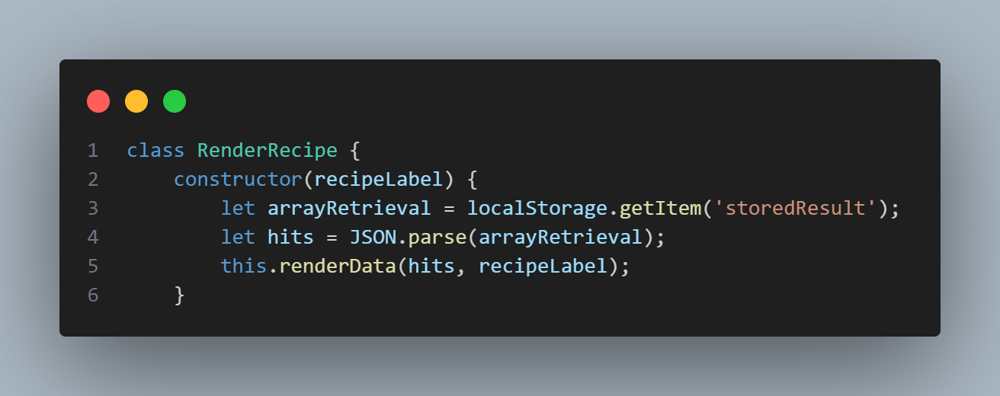

EatEZ Production README

Link to live version:
    https://o-hammad.github.io/EatEZ_Project/

Instructions:
    Here at EatEZ, we want to take the guess work out of preparing your own, healthy meals to satisfy your daily recommended macro-nutrient intake.

    With most of our recipes taking 20 minutes or less to prepare, which is faster than the wait time for take out, simply check our app for recipe inspiration and grab the items at your local store.

    To start, please use the below link to find your daily recommended macro-nutrient intake:

    https://healthyeater.com/flexible-dieting-calculator

    Now that you have your total daily recommended calories and macronutrients, use the filters to find a meal tailored to your required macro-nutrient and caloric intake!

List of technologies / libraries / APIs used:
    1. D3.js
    2. Edamam API

Technical implementation details with (good-looking) code snippets.
    For the structuring of this site, I emmulated React by creating classes such that each class would render the various components of the page.  For example, when the DOM Content is loaded, the RenderPage class is initated.  In the constructor, I further broke down the landing page into smaller componenets like the header, footer and sidebar.  Below is a snippet of the constructor which creates those elements:

    With regards to the API queries, I utilized an async function in my RenderResults which is initialized utilizing an event listener for submission of the search filters.  Here is a snippet of that function which is called in the RenderResult constructor:

    To minimize the number of queries, make my code, and improve performance and efficiency, I stringified the query as a JSON and later retrieved it and parsed it to find the individual results when rendering the recipe as seen in the below code snippets: 

    The final code snippet below illustrates the initalizing of a pie chart that uses a tool tip which when hovering over the respective "slices" of the pie chart shows the grams of the macro-nutrient available in the recipe:

To-dos / future features.
    Future Features
        1. Clear button for search results
        2. Internal calorie and macro-nutrient estimator
        3. Hover effect on pie chart to make the slices grow when hovered over
